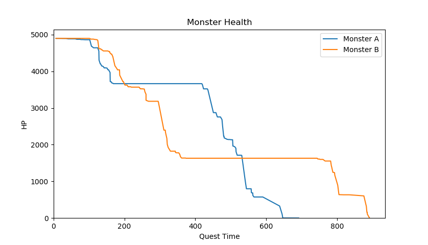

# poogie

poogie contains a set of format specifications and functions which parse network
packets generated by online peer-to-peer sessions in Monster Hunter games.

To use this, you will need some way to capture or clone the packets coming from
the device running the game. ``tcpdump`` is suitable for performing offline
processing. For online processing, you'll need further setup such as tee rules
in ``iptables``. (If you don't know what any of this means, this project isn't
usable for you at this point.)

## Building

## Example

    ./examples/plot-monster-health.py quest.pcap

The quest.pcap file contained a capture of an online MH4U session during the
quest 'Line in the Sand.' The plot displays the health for both Cephadromes
during the quest.

Check out the ``examples/`` directory for other examples.

## Status

At this point, the project is very barebones.

* There are a number of inaccuracies (and a lot of missing stuff) in the format
  specifications-- don't assume anything is correct.

* The wrapper protocols has a number of mechanisms to detect duplicated,
  dropped, and out-of-order packets. This is not taken into account; the example
  scripts just use naive mechanisms such as detecing a change for a given type
  to determine if there has been an update.

For decoding types, you'll want to use ``scripts/watch.py`` and
``scripts/watch-live.py`` which should be helpful in figuring out fields for
types.

## Game Support

### Supported

* Monster Hunter 4 Ultimate (MH4U)

### Unsupported

* Monster Hunter 3 Ultimate (MH3U): The remote packet format is the same, and
  the block and subblock formats appear to be the same. However, types are
  significantly different and the packet contents are not obfuscated.

* Monster Hunter Generations (MHG): The remote packet, obfuscation, block, and
  subblock formats are the same. Types will likely need separate definitions.

* Monster Hunter XX (MHXX): Unchecked.

* Monster Hunter World (MHW): The packet and obfuscation formats are completely
  different and have not been decoded.
